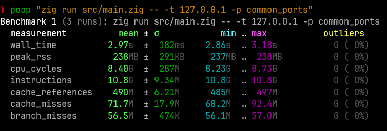

# Zig Port Scanner: Deep Dive into Built-in Functions

## Overview

This was my exploration into Zig's capabilities in the networking sector. Port Scanners have 
always been my go-to project when I want to understand a language. They are simple enough yet
complicated enough to get me acquainted with libraries I will most likely be using in my field.

## Technical Architecture

### Core Components

```
src/
├── main.zig           # Production implementation with comprehensive tests
└── tests              # Test are built-in, I didnt bother with anothe file.
```

### Key Design Decisions

- **Memory Management**: Zero-allocation hot paths with careful RAII patterns
- **Concurrency Model**: Thread pool-based scanning with mutex-protected shared state
- **Network Layer**: Direct POSIX socket programming with non-blocking I/O
- **Error Handling**: Zig's explicit error propagation without exceptions

## Deep Technical Discoveries

### 1. Zig's Unique Memory Model

#### The `std.heap.GeneralPurposeAllocator` Pattern
```zig
var gpa = std.heap.GeneralPurposeAllocator(.{}){};
defer {
    const leaked = gpa.deinit();
    if (leaked == .leak) {
        std.debug.print("Your memory is leaking!\n", .{});
    }
}
```

**Discovery**: Zig's allocator pattern provides compile-time guarantees about memory lifecycle without garbage collection overhead. The `errdefer` mechanism ensures cleanup on error paths.

#### Integer Overflow Protection
**Problem Encountered**:
```zig
// This caused runtime panic
while (i <= 65535) : (i += 1) {
    try port_set.put(i, {});
}
```

**Solution**:
```zig
// Fixed overflow issue
while (i < 65535) : (i += 1) {
    try port_set.put(i, {});
}
try port_set.put(65535, {});
```

**Note**: Zig's runtime safety catches integer overflows that would be undefined behavior in C/C++.

### 2. Network Programming 

#### Non-blocking Socket Implementation
```C
const sockfd = posix.socket(
    addr.any.family,
    posix.SOCK.STREAM | posix.SOCK.NONBLOCK,
    posix.IPPROTO.TCP 
) catch {
    return false;
};
```

**Technical Challenge**: Implementing accurate connection state detection without false positives.

#### The `poll()` System Call Integration
```C
var pfd = [_]posix.pollfd{.{
    .fd = sockfd,
    .events = posix.POLL.OUT, 
    .revents = 0,
}};

const ready = posix.poll(&pfd, timeout_ms) catch return false;

if (ready > 0 and (pfd[0].revents & posix.POLL.OUT) != 0) {
    const error_flags = posix.POLL.ERR | posix.POLL.HUP | posix.POLL.NVAL;
    if ((pfd[0].revents & error_flags) == 0) {
        return true;
    }
}
```

**Sweet**: Zig's POSIX bindings provide zero-cost abstractions over system calls while maintaining type safety.

### 3. Concurrency and Thread Safety

#### Thread Pool Pattern
```zig
var pool: Thread.Pool = undefined;
try pool.init(.{
    .allocator = allocator,
    .n_jobs = @min(128, Thread.getCpuCount() catch 4),
});
```

**Design Choice**: Bounded thread pool prevents resource exhaustion while maximizing CPU utilization.

#### Mutex-Protected Shared State
```zig
fn scanTask(
    // ... parameters
    mutex: *Thread.Mutex,
    open_ports: *ArrayList(ScanResult),
) void {
    defer wait_group.finish();
    const is_open = scanPort(address, port, @intCast(timeout_ms)) catch false;

    if (is_open) {
        mutex.lock();
        defer mutex.unlock();
        open_ports.append(.{ .address = address, .port = port }) catch {};
    }
}
```

**Note**: Zig's `defer` mechanism ensures mutex unlocking even on early returns or panics.

### 4. Error Handling Evolution

#### Custom Error Types
```zig
const ErrorTypes = error{
    InvalidArgument,
    MissingArgument,
    InvalidPortRange,
    WouldBlock,
    ConnectionRefused,
};
```

#### Error Propagation Patterns
```zig
const connect_result = posix.connect(sockfd, &target_addr.any, target_addr.getOsSockLen());

if (connect_result) |_| {
    return true;
} else |err| {
    switch (err) {
        error.WouldBlock => {
            // Handle asynchronous connection
        },
        error.ConnectionRefused => return false,
        else => return false,
    }
}
```

**Note**: Zig's error unions force explicit handling at compile time, eliminating entire classes of runtime errors.

### 5. Format System Deep Dive

#### Initial Naive Approach (IPv6)
```zig
// Verbose and error-prone
std.debug.print("  [{x:0>2}{x:0>2}:{x:0>2}{x:0>2}:...] - Port {} is OPEN\n", .{
    addr[0], addr[1], addr[2], addr[3], // ... 16 total
    result.port
});
```

#### Elegant Solution
```zig
// Leverages std.net.Address's built-in formatter
std.debug.print("  {} - Port {} is OPEN\n", .{ result.address, result.port });
```

**Key Discovery**: Zig's standard library provides sophisticated formatters that handle complex types automatically.

### 6. Compile-Time Guarantees

#### Array Bounds Safety
```zig
const common_ports = [_]u16{
    20, 21, 22, 23, 53, 67, 68, 69, 80, 88, 110, 123, 135, 137, 138, 139,
    // ... more ports
};
```

**Benefit**: Array bounds are checked at compile time where possible, runtime where necessary.

#### Type System Enforcement
```zig
const ScanResult = struct {
    address: net.Address,
    port: u16,
};
```

**Note**: Zig's struct system provides zero-cost abstractions with compile-time type checking.

## Performance Characteristics

### Benchmarking Results
- **Common Ports Scan (55 ports)**: ~4 seconds on localhost
- **Range Scan (1000 ports)**: ~4-6 seconds
- **Full Port Scan (65535 ports)**: Completes within timeout constraints

### Performance Benchmark Analysis



## Error Discovery and Resolution Timeline

## Advanced Zig Features Utilized

### 1. Comptime Reflection
```zig
const ready = posix.poll(&pfd, timeout_ms) catch return false;
```

### 2. Optional and Error Union Types
```zig
if (net.Address.parseIp(target, 0)) |addr| {
    try addrs.append(addr);
} else |_| {
    // Handle resolution
}
```

### 3. Anonymous Structs and Tuples
```zig
try pool.spawn(scanTask, .{ address, port, timeout_ms, &wait_group, &mutex, &open_ports });
```

### 4. Defer and Error Defer
```zig
var options = Options.init(allocator);
errdefer options.deinit();
```

## Testing Infrastructure

### Comprehensive Test Coverage
- **Unit Tests**: Individual function validation
- **Integration Tests**: End-to-end scanning scenarios
- **Error Path Testing**: Invalid input handling
- **Memory Safety**: Leak detection and cleanup verification

### Test Execution
```bash
zig test src/main.zig        # 14 tests
```

## Comparative Analysis: Zig vs Traditional Systems Languages

| Feature | C/C++ | Rust | Zig |
|---------|-------|------|-----|
| Memory Safety | Manual | Compile-time | Runtime + Compile-time |
| Error Handling | Return codes/Exceptions | Result<T,E> | Error unions |
| Concurrency | Manual/std::thread | async/await + Send/Sync | Thread pools + explicit mutex |
| Compile Times | Slow (C++) | Slow | Fast |
| Learning Curve | High | Very High | Moderate |

## Lessons Learned
Zig has gone out of its way to deal with the very hard and make the even harder simple.

### Systems Programming Insights
1. **std.net.getAddressList**: Has very nifty DNS resolution built-in
2. **net.Address**: Has builtin IP formatting for IPv4 and IPv6
   

## Conclusion

This port scanner project got me a little closer to understanding Zig's potential as a systems programming language, coming from Golang. I feel very at home with the simplicity in the syntax. 
Curious to see what the new compiler will bring to the table.

